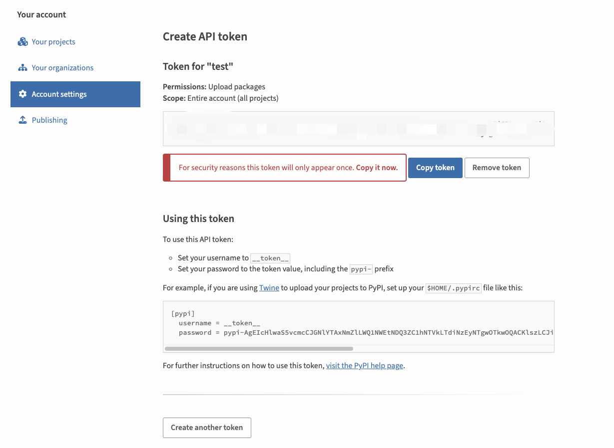

# MCP WaveSpeed Server

WaveSpeed AI 图像和视频生成服务的MCP服务器实现

## Make Package

```bash
python setup.py sdist bdist_wheel

# 上传到PyPI
pip install twine
twine upload dist/*
```

## Pypi apikey



## 安装

### 从PyPI安装

```bash
# 安装
pip install mcp-server-wavespeed
# 运行
mcp-wavespeed --api-key YOUR_API_KEY
```

## 使用

```python
from mcp_server_wavespeed import WaveSpeedServer
server = WaveSpeedServer()
server.run()
```

详见 mcp_client.py
